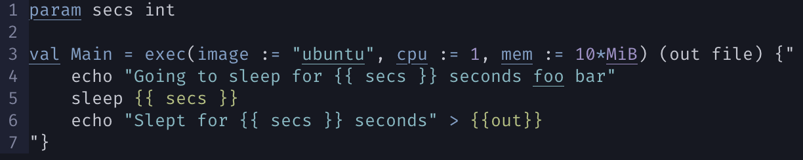

# reflow.vim
Very basic syntax highlighting for [Reflow](https://github.com/grailbio/reflow) files in Vim



## Install with a plugin manager

```
# vim-plug
Plug 'grailbio/reflow.vim'

# vundle 
Plugin 'grailbio/reflow.vim'
```

## Manual installation

Put the `ftdetect` and `syntax` folders in your `~/.vim` or `~/.config/nvim`
directory.
